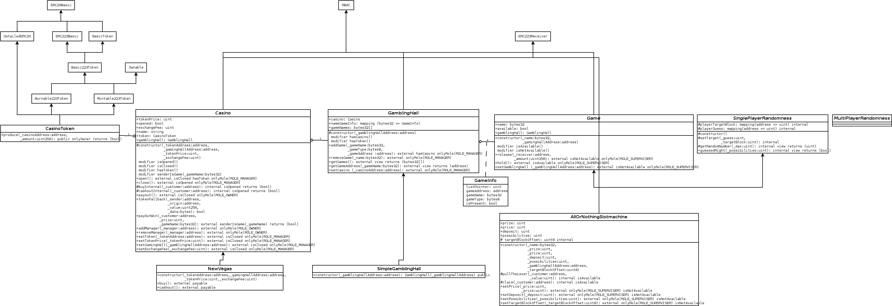
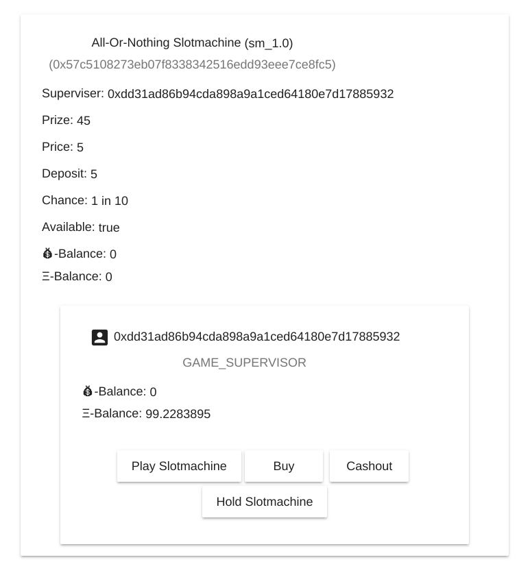

# SC_Ass_Casino
Mario Gastegger - 00726289 - mario.gastegger@gmail.com
June 2018
## Solution
### Environment
Development took place on a debian (Linux HOST 4.9.0-6-amd64 #1 SMP Debian 4.9.88-1+deb9u1 (2018-05-07) x86_64 GNU/Linux) machine.
#### IntelliJ
IntelliJ IDEA 2018.1.4 (Ultimate Edition, Build #IU-181.5087.20) was used to write the javascript and solidity (Intellij Solidity plugin version 2.1.0) code.
The solidity plugin provided only very basic functionallity like auto complete and organize imports.
#### Truffle
A truffle[^1] (v4.1.11) project was created to solve the assignment.
#### Ganache
During development, all tests/testcases were performed on a local ganache[^2] (ganache-1.1.0-x86_64.AppImage) blockchain.
#### Angular & Angular Material
The UI was written with angular 6[^3] and angular material[^4].
### Contract Hierarchy

(The diagram is slightly outdated, please look at the code...)

My final project was a casino, with an own token and games (due to limited time only a slotmachine).
The idea behind the abstract contracts and the separation of gambling hall, randomness, game and token was to allow easy extensibility.
### CasinoToken
**CasinoToken** inherits from **Mintable223Token**, **Burnable223Token** and **DetailedERC20Basic** in order to provied the required capabilities.
The CasinoToken contract provides methods to mint (**produce**).
### Casino
**NewVegas** implements **Casino**, which provides basic functionality for a casino, i.e buy tokens for ether, sell tokens for ether, back the casino with ether and withdraw ether.  A casino has a **GamblingHall** and a **CasinoToken**. It has an owner and an operating manager. The a manager can open and close the casino and switch token and gambling hall. Initially tokens are minted to the casino. The token price with the casino's token balance and the casino's ether balance have to add up, in order to be able to provide possible prize money. When games are played, the tokens are forwarded to the casino. When a player wins, the casino is called by the game, to transfer the prize to the player.
At the moment, there is no mechanism to cleanly replace those.
The casino earns money through token exchange fees (ether -> token and token -> ether).
### GamblingHall
The gambling hall provides functionalities to manage games, i.e. add, remove, list, get address of game, ...
The management of games was implemented using the **Mapped Structs with Delete-enabled Index** pattern explained in https://ethereum.stackexchange.com/a/13168/39566 (an array of game names and a mapping from game name to game data), which limits the storage to the games which are currently in a gambling hall.
### Game
Game implements basic management of games. Games can be hold and release, they have a name (set when adding to a gambling hall) and a type. The type is used to distinguish them in the ui. The Slotmachine is the first and only game, which can be interacted with, by transferring tokens to it. The data field determines the interaction. The game forwards all token payments to the casino. The prize is forwarded from the casino to through the game to the player. There is a deposit required to play the slotmachine. At the moment, the availability of a game is linked to the casino and the game supervisor. There is no mechanism to cleanly reset the slotmachine. 
### SinglePlayerRandomness
The randomness is provided by the abstract contract **SinglePlayerRandomness** it allows committing to a future block hash. Events can be used to get notified about the block which reveals the secret. The committed value depends on the players address, and can thus not be influenced that easy.
### MultiyPlayerRandomness
It is planned to have a 3 phase process - commit, each player commits to a secret, reveal - the players reveal their secret and claim - until then all player have to reveal their secret and claim their deposit back. If that does not happen, a supervisor is allowed to cleanly reset the game. In order for the players to proceed, the supervisor keeps all deposits if the game stalls.
### Web Frontend
The webfrontend was implemented using angular and angular material.
There are areas for the casino, the gambling hall, the token and the involved accounts.
Each contract shows its related accounts. Each account shows its related actions (as buttons or in a dialog, if inputs are required).

### Test Scenario
A test scenario would include the following steps (some steps are already performed by the migration scripts):
1. Deploy the CasinoToken
2. Deploy the GamblingHall
3. Deploy the Game(s)
4. Deploy the casino.
5. Set a manager for the casino
6. Stock up the casino's fund.
7. Produce tokens for the casino.
8. Set a manager for the gambling hall.
9. Set the gambling halls casino.
10. Add games to the gambling hall.
11.  Open the casino.
12. Release the games.
13. Buy tokens at the casino
14. Play the slotmachine by pulling the lever: transfer tokens to the casino with the respective "data".
15. (Wait until the target block is reached.)
16. Claim the prize and the deposit or the deposit only by transferring 0 tokens to the casino - again, with the respective "data"
## Summary & Open Issues
The most time consuming part was to get truffle and truffle-contract to work.
To get started with web3 and angular6 I took a look at: https://medium.com/coinmonks/build-a-dapp-using-ethereum-and-angular-6-a404fbf3c08d
The following list summarises the open issues:
* Truffle: Truffle migrate does not work reliably. Note, in the barcontract assignment it worked a bit more reliably.
* Truffle-contract: The idea was to seamlessly load the .json files generated by truffle and have the addresses of the deployed contracts already set. However this did not work reliably (see fix in migrations). Also the truffle-contract packages uses an old version of web3js which does not support overloaded functions like transfer in the ERC223 token. It would have been a better choice to use only Web3js 1.0 and set the addresses like in CasinoTokenService.
* Netmask: Using Netmask probably does not work at the moment.
* Contracts: There is one multi-player missing due to limited time.
* Contracts: Playing the slotmachine does not work due to a (probalby minor) bug. (Pulling the lever works partly, claim reverts though)
* Contracts: It could would be a good idea to deploy the abstract contracts, which implement most of the functionality, as libraries in order to share code with future version of the components, most of all games.
* Web Interface: The service layer is rather messy and should be refactored (observables).
* Web Interface: The web interface does throw some errors (ng serve), after changing files and saving, it gets rebuilt though and the ui loads as expected.

[^1]: [Truffle](http://truffleframework.com/): development framework for Ethereum.
[^2]: [Ganache](http://truffleframework.com/ganache/): A personal Ethereum blockchain which you can use to run tests, execute commands, and inspect state while controlling how the chain operates. 
[^3]: [Angular](https://angular.io/): An application framework. 
[^4]:  [Angular Material](https://material.angular.io/): A ui framework.
